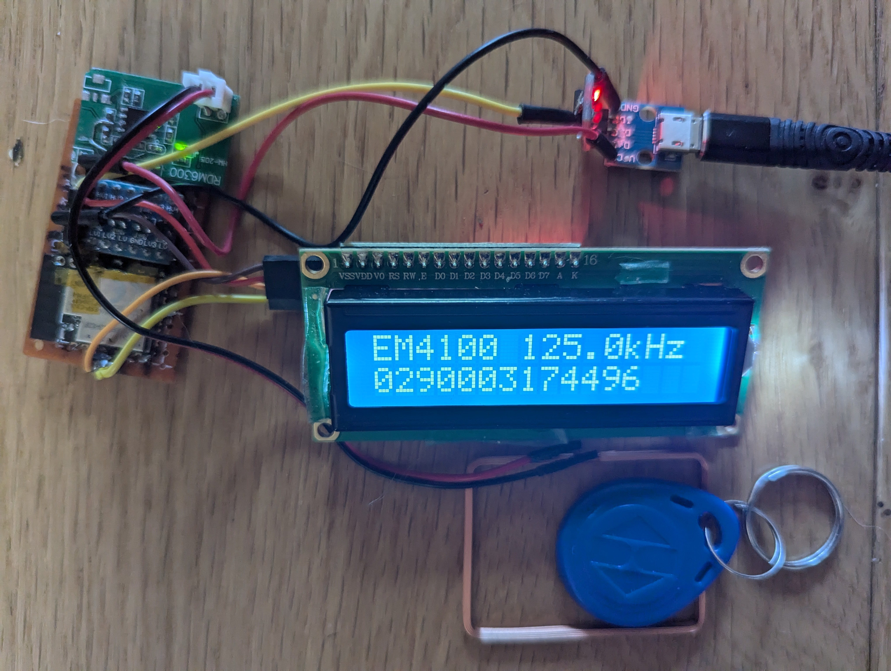
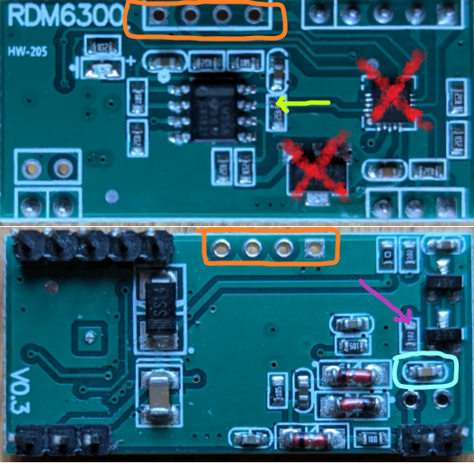

# FDX-B (pet microchip) and EM4100 RFID Reader for ESP32

This app along with suitable hardware will decode the tags in microchipped pets used in the UK and EU which all use the 134.2kHz biphase encoded FDX-B protocol.
It can also be used to decode the 125kHz Manchester encoded EM4100 tags.

The library was developed for use in a microchip controlled catflap, however the RDM6300 hardware used did not have sufficient range to be reliable, but is fine for a handheld pet microchip reader.

The captured tag ID is displayed on a web page and on an optional I2C LCD1602.

### Only use this app if you are familiar with electronics and can fix issues yourself

## Hardware

A custom RFID circuit can be used, but RDM6300 125kHz EM4100 RFID readers can be bought very cheaply and converted for 134.2kHz.

With reference to the picture below:
- the top image shows the decoding circuitry consisting of:
  - a microcontroller that both generates the antenna clock signal and decodes the EM4100 protocol
  - an LM358 dual op amp that both amplifies the received signal and cleans it up (configured as a Schmitt trigger)
- the bottom image is the underside which shows the antenna circuit.
  
To convert it for 134.2kHz pet microchips:
- the microcontroller and the voltage regulator marked with red crosses can be removed or disabled.
- increase the antenna resonant frequency to 134.2kHz, either:
  - reduce the value of the capacitor ringed in cyan.
  - remove some turns from the antenna supplied with the RDM6300 to reduce its inductance.
  - to assist with selecting values use the `antennaFreq.xlsx` spreadsheet in the `extras` folder.
- the ESP32 supplies the input clock signal and decodes the raw data.
- the end of the resistor pointed to by the green arrow is the raw signal output to be sent to the ESP32.
- the end of the resistor pointed to by the pink arrow is for the input clock signal from the ESP32.
- the above connection points can be wired to repurposed header pins circled in orange.
- both of the connections to the ESP32 should be via 5V/3V3 level shifters.

## Installation

Download GitHub files into the Arduino IDE sketch folder, removing `-master` from the application folder name.
Compile using arduino core v2.x or V3.x (min v3.0.3) with Partition Scheme: `Minimal SPIFFS (...)`. 

On first installation, the application will start in wifi AP mode - connect to SSID: **ESP32_RFID_...**, to allow router and password details to be entered via the web page on 192.168.4.1. The configuration data file (except passwords) is automatically created, and the application web pages automatically downloaded from GitHub to the SD card **/data** folder when an internet connection is available. 

Subsequent updates to the application, or to the **/data** folder contents, can be made using the **OTA Upload** tab. The **/data** folder can also be reloaded from GitHub using the **Reload /data** button on the **Edit Config** tab,  or by using a WebDAV client on `ip_address/webdav`.  

## Configuration

The IO Extender web page has the following tabs:

* **RFID**: Shows selected encoding type, Tag ID if read, encoding type selection, plus button to clear tag display.

* **Show Log**: Opens web socket to view log messages dynamically.

* **Edit Config**:

  * **Reboot ESP**: Restart the ESP to apply some configuration changes.

  * **Reload /data**: Reload data files from github.
  
  * **Clear NVS**: Clear current passwords.

  * **Wifi**: WiFi and webserver settings.

  * **Peripherals**: Enter pins for connection to RDM6300 and optional LCD1602, and optional pin for physical button to clear display.

  * **Save**: Make configuration changes persist over ESP reboots.

* **OTA Update**: Use OTA to update application firmware using bin file or files in **/data** folder.

