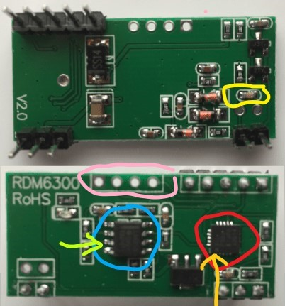

# FDX-B (pet microchip) and EM4100 RFID Reader for ESP32

This software library along with suitable hardware will decode the tags in microchipped pets used in the UK and EU which all use the 134.2kHz biphased encoded FDX-B protocol.
It can also be used to decode the 125kHz Manchester encoded EM4100 tags.

The library was developed for use in a microchip controlled catflap, however the cheap RDM6300 based hardware used did not have sufficient range to be reliable, but is fine for a handheld pet microchip reader.

## Hardware

RDM6300 125kHz EM4100 RFID readers can be bought very cheaply. With reference to the picture below:
- the top image is the underside which shows the antenna circuit. The capacitor ringed in yellow can be changed to modify the antenna resonant frequency.
- the lower image shows the upper side decoding circuitry consisting of:
  - a microcontroller ringed in red that both generates the antenna clock signal and decodes the EM4100 protocol
  - an LM358 dual op amp that both amplifies the received signal and cleans it up (configured as a Schmitt trigger)
  
To convert it for 134.2kHz pet microchips:
- the microcontroller and the voltage regulator can be removed. 
- the ESP32 supplies the input clock signal and decodes the raw data.
- the pin on the Op amp pointed to by the green arrow is the raw signal output to be sent to the ESP32.
- the pad left by the removed microcontroller (leftmost bottom) pointed to by the orange arrow is for the input clock signal.
- these can be wired to repurposed header pins circled in pink.
- both the connections to the ESP32 should be via 5V/3V3 level shifters.
- to increase the frequency of the resonant circuit to 134.2kHz, remove some turns from the antenna supplied with the RDM6300 to reduce its inductance.

## Installation and Use

Download and install the library using your Arduino IDE to the libraries folder.

An example sketch is available in the Examples folder.

